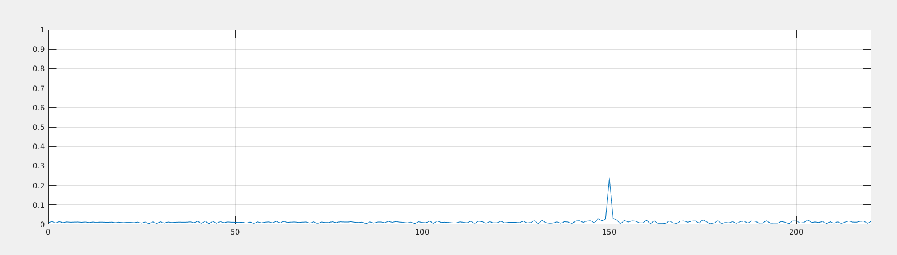
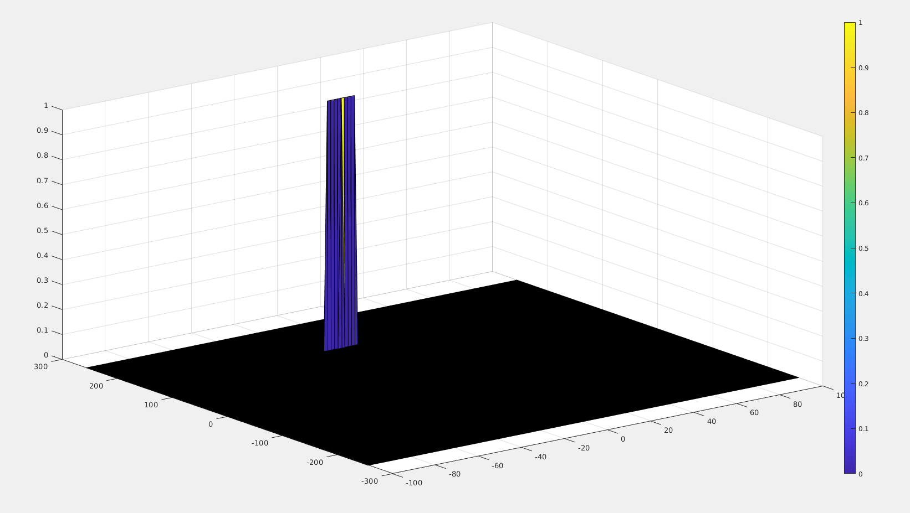
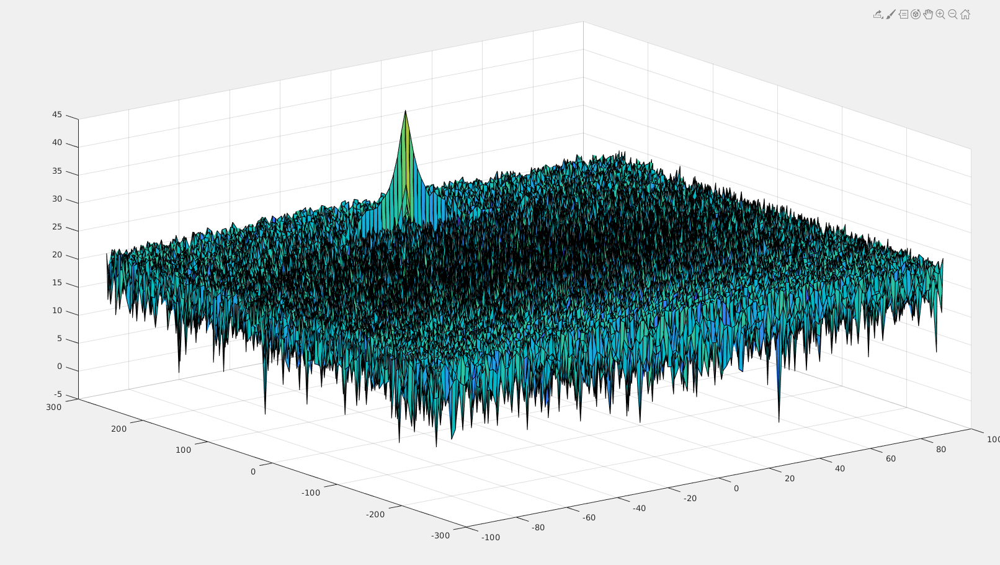

# SFND Radar Target Detection

In this final project, a radar sensor will be used to track objects. To do this, you will complete four major tasks: 

1. Configure the FMCW waveform based on the system requirements.
2. Define the range and velocity of target and simulate its displacement.
3. For the same simulation loop process the transmit and receive signal to determine the beat signal.
4. Perform Range FFT on the received signal to determine the Range.
5. Towards the end, perform the CFAR processing on the output of 2nd FFT to display the target.

## Dependencies for Running Locally
* Matlab >= 2019b
  * All OSes: [click here for installation instructions](https://www.mathworks.com/?s_tid=gn_logo)

## Basic Build Instructions

1. Clone this repo.
2. Run 'radar_target_generation_and_detection.m'

## Final Project Report

### FP.1 FMCW Waveform Design
Using the given system requirements, design
a FMCW waveform. Find its Bandwidth (B), chirp time (Tchirp) and slope of the chirp.
The slope is 2.0455e+13 which arround 2e13.

### FP.2 Simulation Loop
Simulate Target movement and calculate the beat or mixed signal for every timestamp.
This is already implemeted in 'radar_target_generation_and_detection.m' from line 69 to 89.

### FP.3 Range FFT (1st FFT)
Implement the Range FFT on the Beat or Mixed Signal and plot the result.
I set the target position at 150(m).
Here is the result:

### FP.4 2D CFAR
1. Here is the final output matching the walkthrough

2. In a README file, write brief explanations for the following:
* Implementation steps for the 2D CFAR process --> As shown in the walk through , the implementation is done 
  'radar_target_generation_and_detection.m' in lines 199 to 230.
* Selection of Training, Guard cells and offset --> Had to change the offset to 0.4.
* Steps taken to suppress the non-thresholded cells at the edges --> by initializing the output signal with zero ,
  then for each cycle in 2D CFAR process the CUT is checked against the calculated threshold.
  If the CUT is bigger that the calculated threshold, then the output signal map is set to one , else it set to zero.